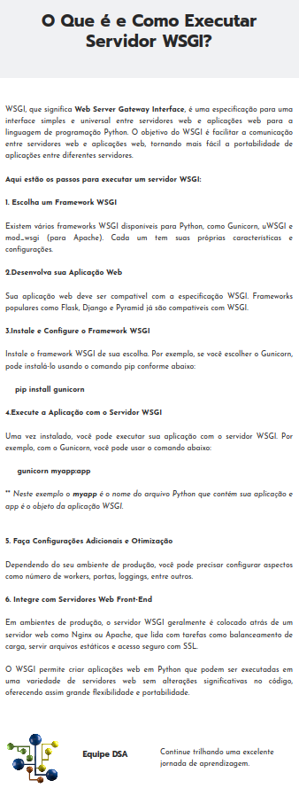

# Flask

Flask

### Documentação Online

http://localhost:5000/openapi/swagger

### WSGI

## References

- https://flask.palletsprojects.com/en/3.0.x/
- https://flask.palletsprojects.com/en/3.0.x/blueprints/
- https://luolingchun.github.io/flask-openapi3/v3.x/Example/
